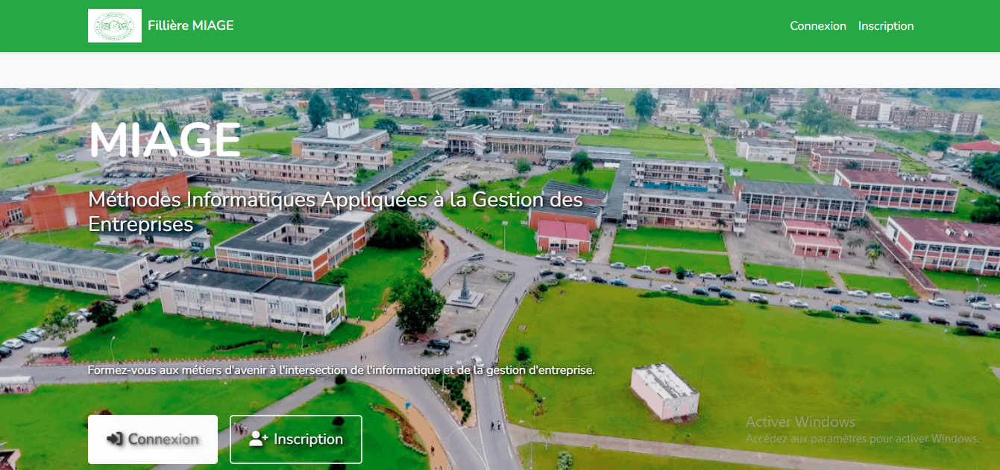
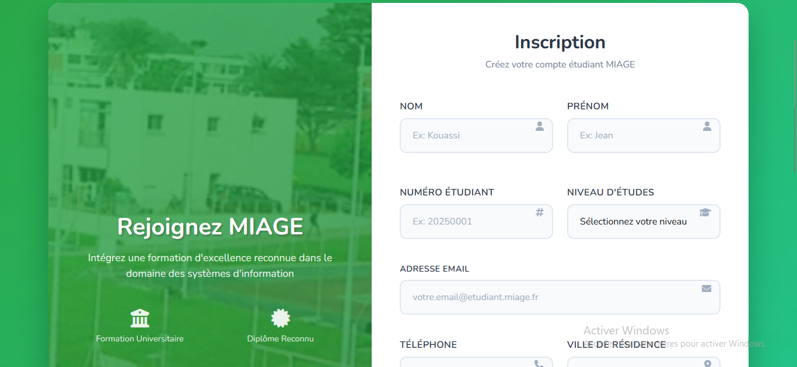
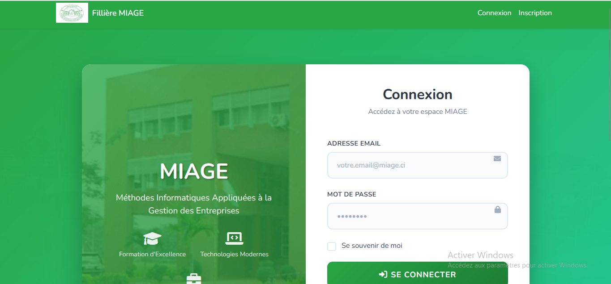
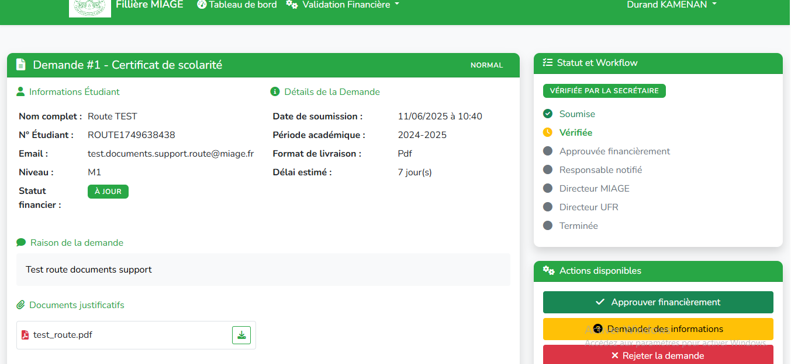
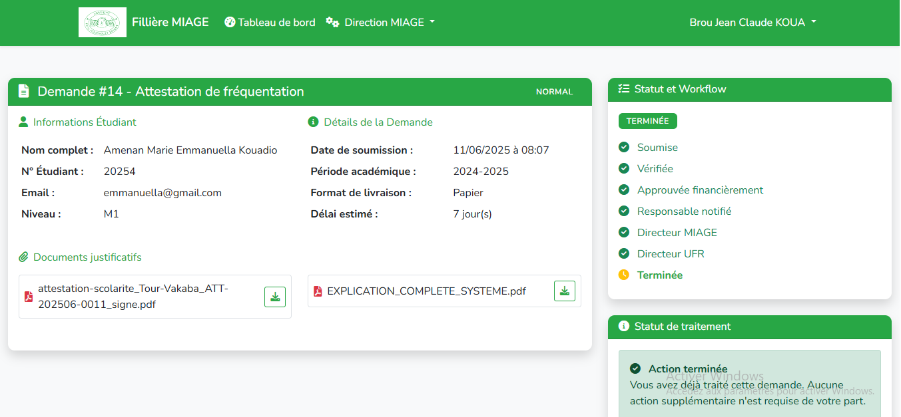
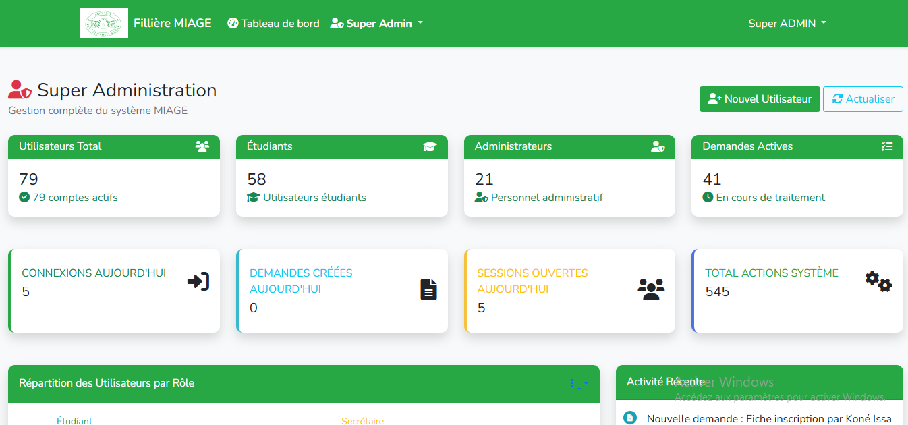
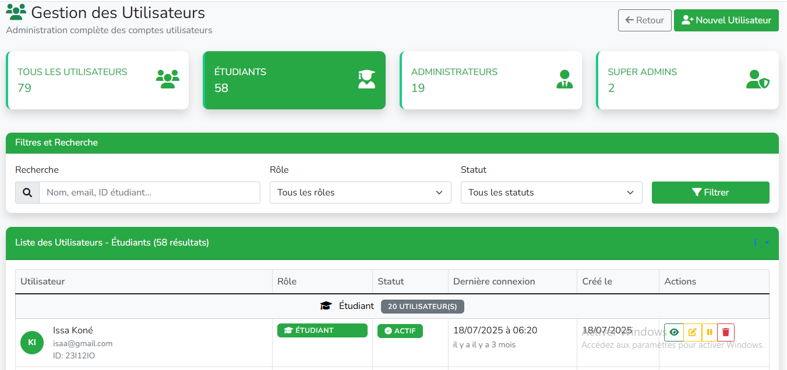
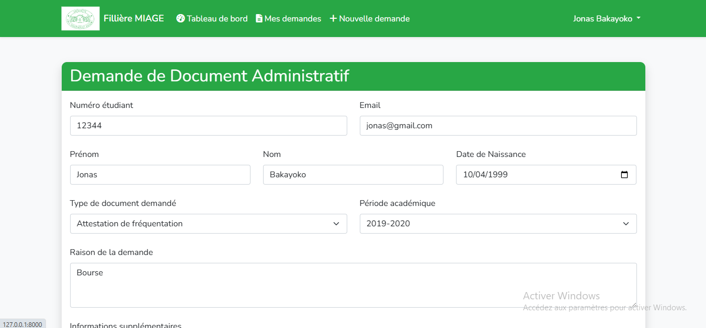
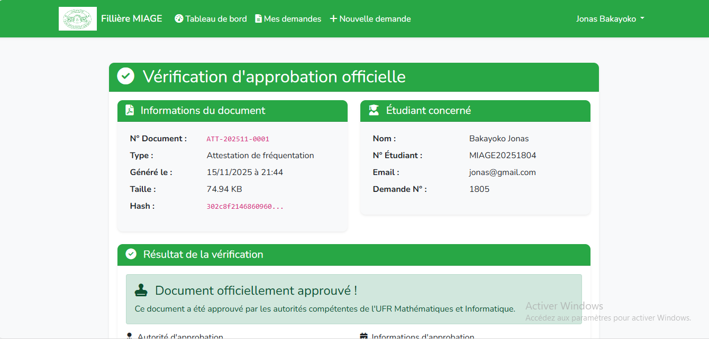

# Système de Gestion des Demandes de Documents - MIAGE

Module de demande et génération automatique de documents administratifs pour les étudiants

[](https://laravel.com)
[](https://php.net)
[](LICENSE)

## À propos du projet

Ce projet représente **le module de gestion des demandes de documents** développé dans le cadre d'un système universitaire plus large. Il permet aux étudiants de soumettre des demandes de documents administratifs (attestations, certificats, fiches d'inscription, etc.) et de suivre leur traitement à travers un workflow d'approbation multi-niveaux.

**Note importante** : Ce repository contient **uniquement la documentation complète** du module de demande de documents avec captures d'écran pour présenter le projet. Aucun code source n'est inclus dans ce repository public. Le site universitaire complet comprend également d'autres modules (gestion des cours, notes, emplois du temps, etc.) qui ne sont pas documentés ici.

## Fonctionnalités principales

### Pour les étudiants
- Soumission de demandes de documents en ligne
- Upload de pièces justificatives
- Notifications en temps réel sur l'avancement
- Consultation et téléchargement des documents générés
- Historique complet des demandes

### Pour l'administration
- Workflow d'approbation multi-niveaux
- Génération automatique de PDF signés électroniquement
- Gestion des rôles (Secrétaire, Responsable financier, Directeur MIAGE, Directeur UFR)
- Tableau de bord avec statistiques
- Système de recherche et filtrage avancé

## Captures d'écran

### Interface étudiant

#### Tableau de bord étudiant

*Vue d'ensemble des demandes et statistiques personnelles*

#### Formulaire de demande

*Interface intuitive pour soumettre une nouvelle demande*

#### Suivi des demandes

*Visualisation en temps réel du statut de chaque demande*

#### Documents générés

*Consultation et téléchargement des documents finalisés*

### Interface administration

#### Tableau de bord administrateur

*Vue globale avec statistiques et métriques*

#### Gestion des demandes

*Interface de traitement et validation des demandes*

#### Workflow d'approbation

*Suivi du processus d'approbation multi-niveaux*

#### Génération de documents

*Prévisualisation et gestion des documents générés*

#### Notifications

*Système de notifications en temps réel*

#### Paramètres

*Configuration du système et gestion des utilisateurs*

#### Profil utilisateur

*Gestion du profil et des préférences*

## Technologies utilisées

### Backend
- **Laravel 12.x** - Framework PHP moderne
- **PHP 8.2+** - Langage de programmation
- **MySQL** - Base de données relationnelle
- **DomPDF** - Génération de documents PDF
- **Laravel Notifications** - Système de notifications

### Frontend
- **Blade Templates** - Moteur de templates Laravel
- **Tailwind CSS** - Framework CSS utility-first
- **Alpine.js** - Framework JavaScript léger
- **Lucide Icons** - Bibliothèque d'icônes moderne

### Outils de développement
- **Composer** - Gestionnaire de dépendances PHP
- **NPM** - Gestionnaire de paquets JavaScript
- **Vite** - Build tool moderne

## Informations techniques

### Prérequis système

- PHP >= 8.2
- Composer
- MySQL >= 8.0
- Node.js >= 18.x
- Extension PHP GD (pour la génération de PDF avec images)

### Stack technique

Le projet utilise une architecture Laravel standard avec :
- Modèle MVC (Model-View-Controller)
- Eloquent ORM pour la gestion de la base de données
- Blade pour les templates
- Middleware pour la gestion des rôles et permissions
- Services pour la logique métier
- Notifications pour les alertes en temps réel

**Note** : Le code source complet n'est pas disponible dans ce repository public. Cette section présente uniquement les informations techniques pour comprendre l'architecture du projet.

## Configuration

### Extension PHP GD

L'extension GD est requise pour la génération de PDF avec images (logos, photos).

**Windows :**
1. Ouvrir `php.ini`
2. Décommenter : `extension=gd`
3. Redémarrer le serveur web

**Linux :**
```bash
sudo apt-get install php-gd
sudo systemctl restart apache2
```

### Permissions des dossiers

```bash
chmod -R 775 storage bootstrap/cache
chown -R www-data:www-data storage bootstrap/cache
```

## Responsive Design

Le système est entièrement responsive et optimisé pour :
- Smartphones (iOS & Android)
- Tablettes
- Ordinateurs de bureau
- Grands écrans

Tous les composants s'adaptent automatiquement à la taille de l'écran pour une expérience utilisateur optimale.

## Rôles et permissions

Le système implémente un contrôle d'accès basé sur les rôles (RBAC) :

| Rôle | Permissions |
|------|------------|
| **Étudiant** | Soumettre des demandes, consulter ses documents |
| **Secrétaire** | Vérifier les demandes initiales |
| **Responsable Financier** | Approuver les aspects financiers |
| **Responsable Niveau** | Valider les demandes de son niveau |
| **Directeur MIAGE** | Traiter les demandes MIAGE |
| **Directeur UFR** | Approbation finale |

## Workflow des demandes

```
Étudiant soumet demande
    ↓
Secrétaire valide
    ↓
Responsable financier approuve
    ↓
Responsable niveau valide
    ↓
Directeur MIAGE traite
    ↓
Directeur UFR approuve
    ↓
Document généré automatiquement
    ↓
Étudiant notifié et peut télécharger
```

## Architecture du code

Structure générale du projet (à titre informatif) :

```
app/
├── Http/
│   ├── Controllers/
│   │   ├── DocumentRequestController.php    # Gestion des demandes
│   │   └── DocumentGenereController.php     # Gestion des documents générés
│   └── Middleware/
│       └── CheckRole.php                     # Vérification des rôles
├── Models/
│   ├── DocumentRequest.php                   # Modèle de demande
│   ├── DocumentGenere.php                    # Modèle de document généré
│   └── User.php                              # Modèle utilisateur
├── Services/
│   ├── DocumentPdfService.php                # Génération de PDF
│   ├── DocumentRequestAdapterService.php     # Adaptation des données
│   └── SignatureElectroniqueService.php      # Signature électronique
└── Notifications/
    └── DocumentRequestNotification.php       # Notifications

resources/
├── views/
│   ├── documents/
│   │   ├── index.blade.php                   # Liste des demandes
│   │   ├── create.blade.php                  # Formulaire de demande
│   │   ├── show.blade.php                    # Détails d'une demande
│   │   └── mes_documents.blade.php           # Documents de l'étudiant
│   └── layouts/
│       └── app.blade.php                     # Layout principal
└── js/
    └── app.js                                # JavaScript principal
```

**Note** : Cette structure est présentée à titre informatif pour comprendre l'organisation du projet. Le code source n'est pas disponible dans ce repository.

## Types de documents supportés

- Attestation de fréquentation
- Certificat de scolarité
- Relevé de notes
- Attestation de réussite
- Fiche d'inscription
- Attestation de stage
- Certificat de fin d'études

## Contribution

Les contributions sont les bienvenues ! N'hésitez pas à :

1. Fork le projet
2. Créer une branche (`git checkout -b feature/AmazingFeature`)
3. Commit vos changements (`git commit -m 'Add some AmazingFeature'`)
4. Push vers la branche (`git push origin feature/AmazingFeature`)
5. Ouvrir une Pull Request

## Contenu de ce repository

### Ce qui est inclus

- **Documentation complète** : README détaillé avec description du projet et des fonctionnalités
- **Captures d'écran** : 11 images illustrant toutes les interfaces et fonctionnalités
- **Architecture** : Description détaillée du système, du workflow et de la structure
- **Informations techniques** : Stack technologique et prérequis système

### Ce qui n'est PAS inclus

- **Code source** : Aucun code source n'est disponible dans ce repository public
- **Autres modules** : Seul le module de demande de documents est documenté
- **Données sensibles** : Aucune donnée de production ou information confidentielle
- **Configuration privée** : Aucun fichier de configuration avec données sensibles

**Pourquoi ?** Ce repository sert de **portfolio et documentation** pour présenter le projet. Le code source complet est maintenu en privé pour des raisons de sécurité et de propriété intellectuelle.

## Licence

Ce projet est sous licence MIT. Voir le fichier `LICENSE` pour plus de détails.

## Auteur

**Mohkone01**

- GitHub: [@Mohkone01](https://github.com/Mohkone01)

## Remerciements

- Laravel Framework
- Tailwind CSS
- DomPDF
- Tous les contributeurs open source

## Support

Pour toute question ou problème :
- Ouvrir une issue sur GitHub
- Consulter la documentation Laravel

---

Si ce projet vous a été utile, n'hésitez pas à lui donner une étoile !
